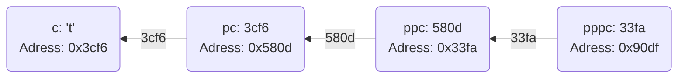
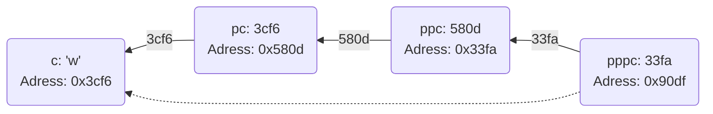

<!-- Um alle Diagramme und Formatierungen korrekt zu sehen, betrachte diese Datei bitte auf GitHub. -->
### Interpretieren Sie die folgenden Statements:

**Antwort**

- `int n = 44;`
	- Eine Variable `n` vom Datentyp `int` wird deklariert und mit dem Wert `44` initialisiert.

- `int* p = &n;`
	- Ein Zeiger `p` vom Datentyp `int` wird deklariert und mit der Speicheradresse von `n` initialisiert.
  
- `++(*p);`
	- Inkrementiert den Wert an der Speicheradresse von `p` (also den Wert von `n`) um eins.
  
- `++p;`
	- Inkrementiert die Speicheradresse im Zeiger `p` um eins. Dies bedeutet, dass `p` nun auf die nächste Speicheradresse zeigt, was normalerweise nicht sinnvoll ist, wenn `p` auf eine einzelne `int`-Variable zeigt.
  
- `int* const cp = &n;`
	- Ein konstanter Zeiger `cp` wird deklariert und mit der Speicheradresse von `n` initialisiert. Der Zeiger selbst ist konstant, d.h., er kann nicht auf eine andere Adresse zeigen.

- `++(*cp);` 
	- Inkrementiert den Wert an der Speicheradresse von `cp` (also den Wert von `n`) um eins.

- `++cp;`
	- Versucht, die Speicheradresse im Zeiger `cp` um eins zu inkrementieren, was jedoch nicht möglich ist, da `cp` ein konstanter Zeiger ist. Dies führt zu einem Kompilierfehler.

- `const int k = 88;`
	- Eine konstante Variable `k` vom Datentyp `int` wird deklariert und mit dem Wert `88` initialisiert.

- `const int* pc = &k;`
	- Ein Zeiger `pc` auf einen `const int` wird deklariert und mit der Speicheradresse von `k` initialisiert. Der Zeiger kann auf eine andere Adresse zeigen, aber der Wert, auf den er zeigt, kann nicht geändert werden.

- `++(*pc);`
	- Versucht, den Wert an der Speicheradresse von `pc` zu inkrementieren. Dies ist nicht möglich, da `pc` auf einen `const int` zeigt. Dies führt zu einem Kompilierfehler.

- `++pc;`
	- Inkrementiert die Speicheradresse im Zeiger `pc` um eins. Dies ist erlaubt, da der Zeiger selbst nicht konstant ist.

- `const int* const cpc = &k;`
Ein konstanter Zeiger `cpc` auf einen `const int` wird deklariert und mit der Speicheradresse von `k` initialisiert. Weder der Zeiger noch der Wert, auf den er zeigt, können geändert werden.

- `++(*cpc);`  
	- Versucht, den Wert an der Speicheradresse von `cpc` zu inkrementieren. Dies ist nicht möglich, da `cpc` auf einen `const int` zeigt. Dies führt zu einem Kompilierfehler.

- `++cpc;`
	- Versucht, die Speicheradresse im Zeiger `cpc` um eins zu inkrementieren, was jedoch nicht möglich ist, da `cpc` ein konstanter Zeiger ist. Dies führt zu einem Kompilierfehler.

### Pointer können auch auf weitere Pointer zeigen. Erstellen Sie die Kette!

<!--
char c = 't';
char* pc = &c;
char** ppc = &pc;
char*** pppc = &ppc;

***pppc = 'w';
-->

Line 1 - 4:

Line 5:

### Was passiert da in der letzten Zeile?
Mit `***pppc = 'w';` wird `char c` auf den Wert 'w' geändert. Das passiert, weil `***pppc` über dreifache Dereferenzierung auf den ursprünglichen Charakter `c` zugreift und diesen ändert.
